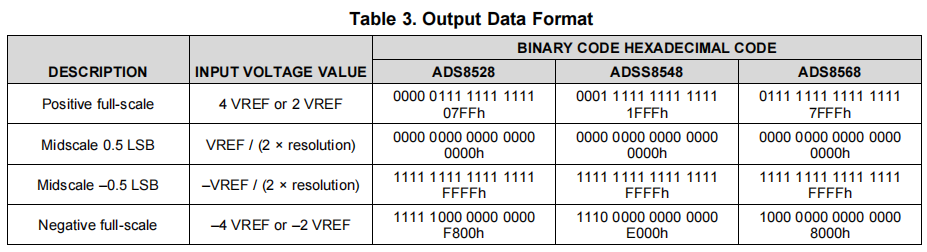

# 0 功能需求

采用ADS8568对256路通道进行采样，预方案为32片级联

# 1 ADS8568特性

- ADS8568：510kSPS (PAR) 或400kSPS (SER)

- ADS85x8 具备 8 个基于逐次逼近寄存器 (SAR) 的低 功耗 12 位、14 位或 16 位模数转换器 (ADC)，每个ADC 都配有真正的双极输入。这些通道分组为四对， 能够以高达 650kSPS 的速率同时采集信号。

# 2 数字端口声明

所有的TYPE是针对AD来说的，AD采用串行模式，实现：

- HH：硬件拉高

- HL：硬件拉低

| PIN        | TYPE  | DESCRIPTION                                                  | 实现 |
| ---------- | ----- | ------------------------------------------------------------ | ---- |
| ASLEEP     | DI    | **0：正常模式** 1：睡眠模式                             | HL   |
| BUSY/INT   | DO    | CONFIG[27]=0：**BUSY模式**，拉高表示转换开始，拉低1个tCCLK表示一对通道转换完成，全部转换完成保持低 CONFIG[27]=1：INT模式，只适用于所有通道CONVST绑定，所有通道同步采集；拉高表示转换结束，保持高直到下一次读取 | D    |
| CONVST_x   | DI    | 上升沿表示对应通道转换同步开始                               | 绑定 |
| FS         | DI    | FS：下降沿控制帧传输                                         | D    |
| DCIN_x     | DI    | **当DCEN=1 SEL_x=1，DCIN_x接收级联芯片上级的SDO_x** 当DCEN=0，连接到DGND | HH   |
| SEL_CD     | DI    | **1，SEL_B=1：通道对x在对应的SDO_x输出** 0，SEL_B=1：通道对A和C在SDO_A输出，通道对B和D在SDO_B输出 x，SEL_B=0：所有通道都在SDO_A输出 | HH   |
| SEL_B      | DI    | 同SEL_CD一起使用                                             | HH   |
| DCEN       | DI    | **1：级联使能**                                              | HH   |
| SDI        | DI    | **硬件模式：DGND** 软件模式：串行输入                   | HL   |
| SCLK       | DI    | 串行接口时钟输入                                             | D    |
| REFBUFEN   | DI    | **硬件模式：0 内部参考buffer使能** 软件模式：DGND       | HL   |
| SDO_x      | DO    | 配合SEL_x，输出对应通道对的数据                              | D    |
| HW/SW      | DI    | **0：硬件模式** 1：软件模式                             | HL   |
| PAR/SER    | DI    | 0：并行接口 **1：串行接口**                             | HH   |
| RANGE/XCLK | DI/DO | **硬件模式：0 模拟输入【-4VREF，4VREF】 1模拟输入【-2VREF，2VREF】** 软件模式：CONFIG[29]=1 外部转换时钟输入，CONFIG[28]=1 内部转换时钟输出 | 选择 |
| RD         | DI    | DGND                                                         | HL   |
| REFEN/WR   | DI    | 硬件模式：**1 内部参考使能** 0 参考外部REFIO 软件模式：DGND | HH   |
| RESET      | DI    | 1：复位，宽度至少50ns，CONFIG复位为000003FF                  | D    |
| STBY       | DI    | 硬件模式：0 设备下电 **1 正常模式** 软件模式：DGND      | HH   |

# 3时序

默认情况下，AD使用内部时钟CCLK。一个完整的转换包括对采样电容的预充电（19~20CCLK），取决于CONVST_x与CCLK上升沿的位置关系。

​	SDO_x输出由最高位（MSB）开始，**在SCLK的下降沿更新**，可以在下降沿前（1个SYS_CLK）采集数据

## 配置参数

| tCVL    | CONVST_x低电平时间       | > 20ns    |                  |
| ------- | ------------------------ | --------- | ---------------- |
| tCVH    | CONVST_x高电平时间       | >tCCLK    | 200ns            |
| tFSCV   | FS结束到下一次CONVST时间 | > 40ns    |                  |
| tBUFS   | BUSY低电平到FS低电平     | > 86ns    | 100ns            |
| tSCLK   | SCLK时钟                 | 0.1~45MHz | 40MHz            |
| tFSSCLK | FS下降沿到SCLK下降沿时间 | >12ns     | 10+（tSCLK/2）ns |

## 状态参数

| tCCLK | 内部时钟周期               | ~85ns   |      |
| ----- | -------------------------- | ------- | ---- |
| tACQ  | 获取时间                   | > 280ns | -    |
| tCONV | 转化时间                   | <1.7us  | -    |
| tDCVB | CONVST_x高电平到BUSY高电平 | < 25ns  |      |
| tDMSB | FS低到第一个数据MSB时间    | < 12ns  |      |
| tHDO  | SCLK下降沿数据保持时间     | > 5ns   |      |
| tPDDO | SCLK下降沿到新数据更新时间 | < 17ns  |      |
| tDTRI | FS高到SDO_x进入三态时间    | < 10ns  |      |

未使用

| tHDI  | SDI与SCLK下降沿的保持时间 | > 5ns |      |
| ----- | ------------------------- | ----- | ---- |
| tSUDI | SDI与SCLK下降沿的建立时间 | > 3ns |      |

**BUSY信号在任意CONVST信号的上升沿拉高，并在最后一个通道完成转换后拉低。**

INT信号在一个新通道转换完成拉高，直到下一次转换开始拉低。

级联模式下，第一个AD的DCEN拉低。

# 4设计

## 片间连线

采用多片级联，SCLK、CONVST、FS全部捆绑，所有BUSY通过或门得到总的BUSY信号，那么与FPGA的交互线总计9条：

SDI作为备用信号口，用于配置AD的寄存器，若功能无法正常运行时进行测试使用。

## 单次采样

串行单次采样时序设计：

数据采样点设置在sclk的下降沿前一个半时钟的上升沿，数据相对稳定。

## 级联采样

硬件之间连接简图如下

采用16片AD一组，两组分别采样探测器的奇偶通道，将数据上传给FPGA。级联之后数据的时序如下

